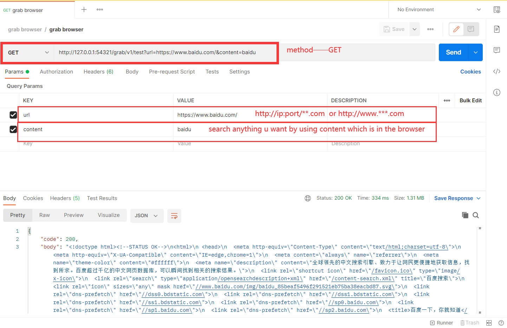
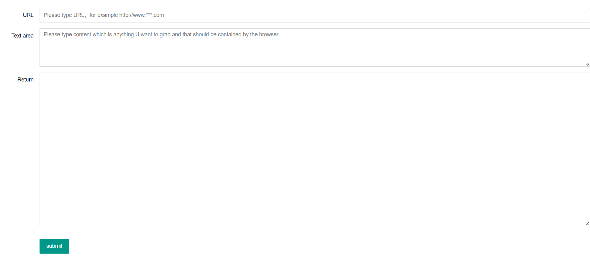

# Getting Started

### Reference Documentation
#### crawlerTestingOfFrank-0.0.1-SNAPSHOT.jar
* there is a jar package which name is crawlerTestingOfFrank-0.0.1-SNAPSHOT.jar
* * Please use this below command to start application
* * java -jar crawlerTestingOfFrank-0.0.1-SNAPSHOT.jar
* U can test the crawler by using postman with this link http://127.0.0.1:54321/grab/v1/test
* method: get
* parameter is content and url
  

*  or using this link——http://127.0.0.1:54321/grab/v1/index
* [please click above link to access index after application started](http://127.0.0.1:54321/grab/v1/index)
* u will see this page

